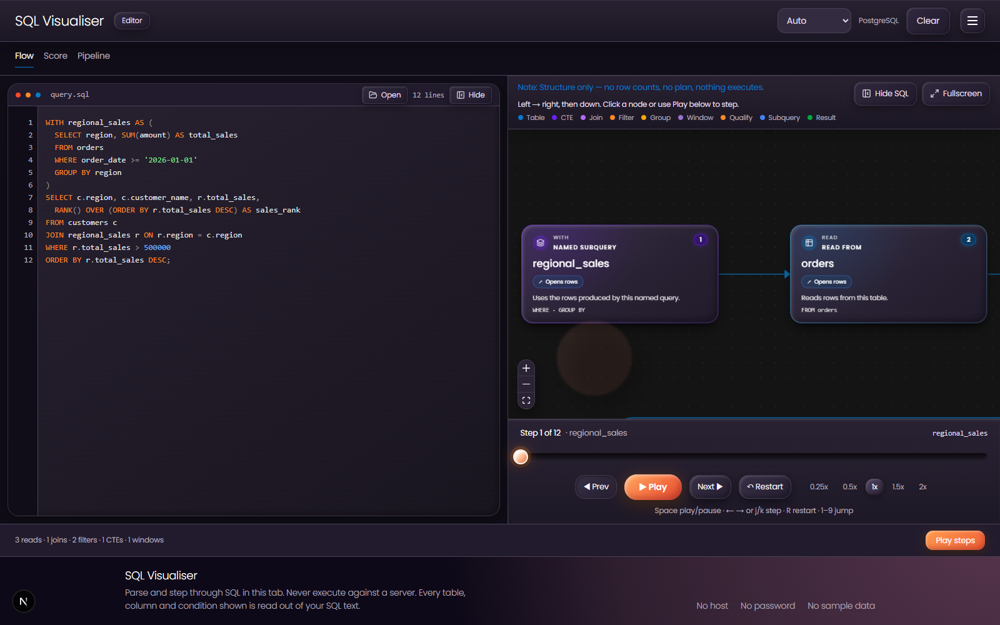
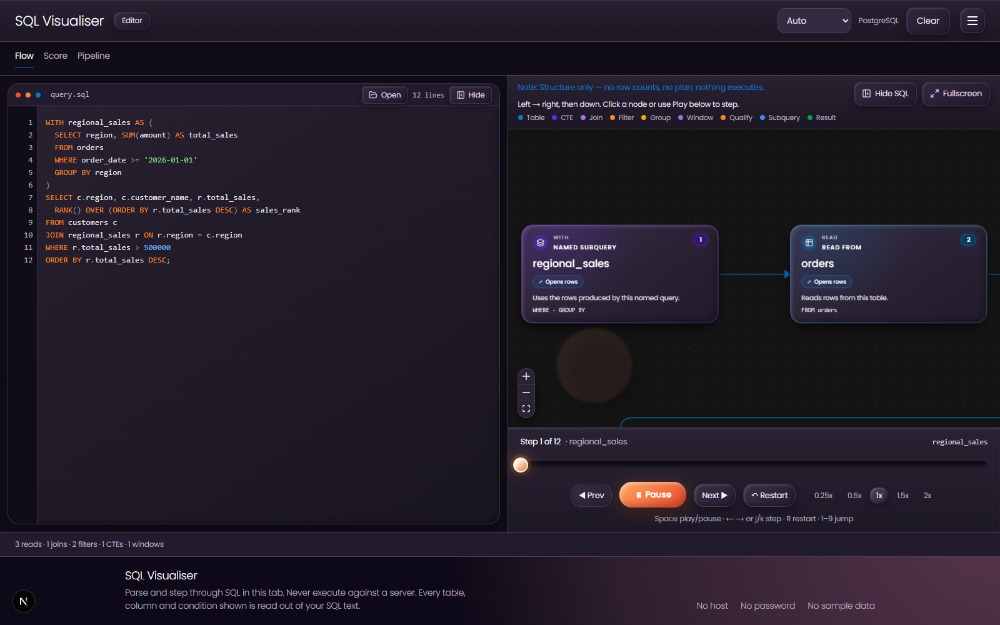

# SQL Visualiser

Paste a query and see its logical execution flow. SQL Visualiser turns tables,
joins, filters, groups, windows, subqueries, and results into a readable diagram
without connecting to or executing against a database.

The editor and flow stay side by side while you click, step, scrub, or play
through the query.





## What it shows

- Logical execution order, from reads and joins through to the final result
- Cardinality cues for operations that widen, shrink, or group rows
- CTEs, window functions, correlated subqueries, and set operations
- Linked SQL and diagram selection
- A playable timeline for walking through each operation
- Static findings without made-up runtime costs or row counts

## Tech

- Next.js and React
- xyflow for the interactive diagram
- node-sql-parser for parsing and AST traversal
- GSAP for focused motion and camera transitions
- TypeScript and Tailwind CSS

## Run locally

```bash
npm install
npm run dev
```

Open [http://localhost:3000](http://localhost:3000), then paste SQL, open a
`.sql` file, or drop one onto the page.

Useful checks:

```bash
npm run lint
npm run build
npx tsx --tsconfig tsconfig.json scripts/audit-scenarios.mts
```
